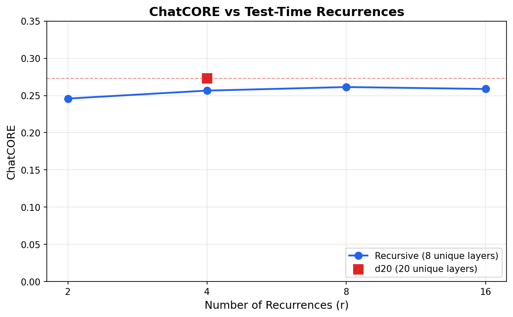

# Recursive NanoChat d20 (i.e. 20 layers effective depth, ~$100 model)

**A recursive tranformer implementation of NanoChat.**

About Recursive NanoChat:
- This model is trained on the same amount of data and using roughly the same number of flops as a [non-recursive 20 layer nanochat model](https://huggingface.co/Trelis/nanochat).
- It has roughly half of the original model parameters.
- See the `recursive` branch of [https://github.com/TrelisResearch/nanochat]() for details on how to download and run.

## Design Choices
- (P, R, C) = (2, 4, 2) → 8 unique layer weights # 2 prelude layers, 4 recursive and 2 coda
- train_recur_mean = 4.0 → effective depth 20 (matches original depth=20) # 2 + 4*4 + 2 = 20
- train_recur_max = 16 # Number of recurrences during training are sampled from a Poisson log-normal distribution (σ=0.5) with a mean of train_recur_mean = 4.0
- bptt_k = 4 → gradient flows through max 16 recur layers # So that the mean case has full back prop but higher level of recurrence are truncated
- inject_mode = "concat_linear" (learned adapter, identity-initialized) # the recycle stream is concatenated with inputs and passed through a shrinking linear layer; identity-init ensures gradients flow
- recur_warm_start = True # the recycle stream is zero initialised for the first token generated, but the next token borrows the last state from the previous token, accelerating inference
- kv_cache_recur_budget = 1 (cache only final recurrence) # the final recurrence state is always used for later tokens, saving memory and assisting accuracy
- Sampling: Poisson log-normal distribution (σ=0.5) # this was used for pre-, mid- and sft- training. Although perhaps it would have been better to use a constant number of recursions for the mid and post training, which would also allow torch compile to be used for mid-training.

## Results

### SFT

| Metric | d20 | Recursive r=2 | Recursive r=4* | Recursive r=8 | Recursive r=16 |
|--------|-----|---------------|----------------|---------------|----------------|
| ARC-Easy | 0.4630 | 0.4141 | 0.4306 | 0.4423 | 0.4381 |
| ARC-Challenge | 0.3234 | 0.3063 | 0.3114 | 0.3106 | 0.3123 |
| MMLU | 0.3222 | 0.3119 | 0.3158 | 0.3185 | 0.3179 |
| GSM8K | 0.0508 | 0.0356 | 0.0614 | 0.0599 | 0.0644 |
| HumanEval | 0.1220 | 0.0793 | 0.0793 | 0.0915 | 0.0793 |
| SpellingBee | 0.9883 | 0.9844 | 0.9883 | 0.9883 | 0.9844 |
| **ChatCORE** | **0.2732** | **0.2459** | **0.2566** | **0.2614** | **0.2588** |

*r=4 is iso-flops with d20 (same effective depth of 20 layers)

*The recursive model (8 unique layers, ~328M params) approaches d20 performance (20 unique layers, ~561M params) as test-time recurrences increase. At r=4 (iso-flops), the recursive model achieves 94% of d20's ChatCORE with 42% fewer parameters.*